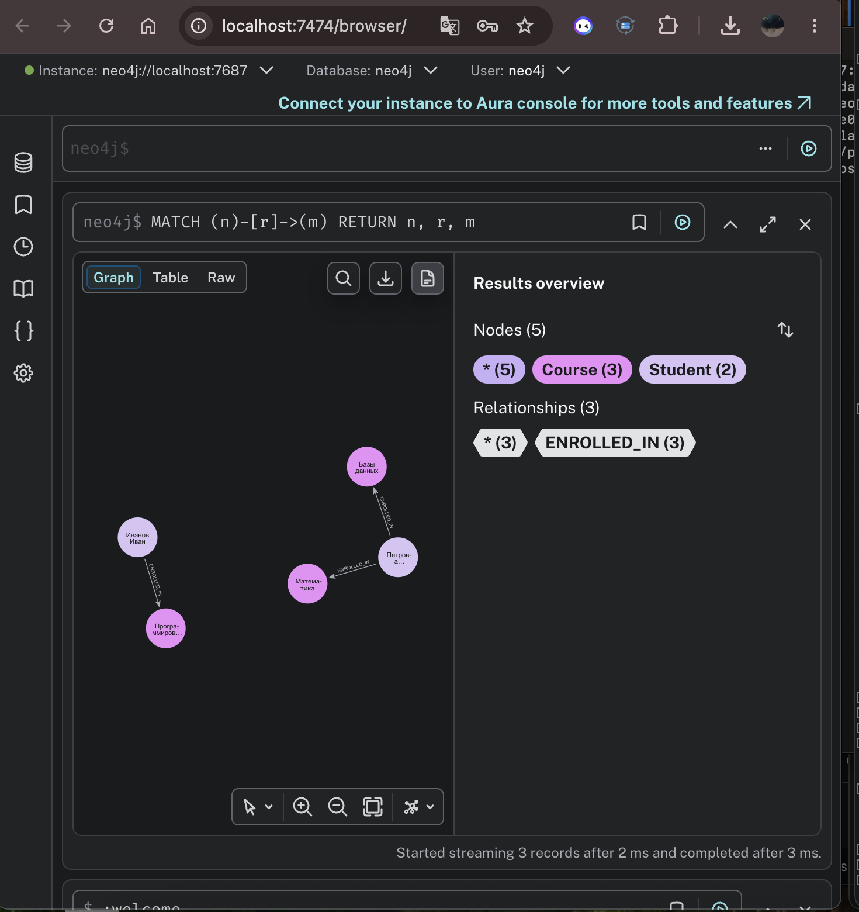
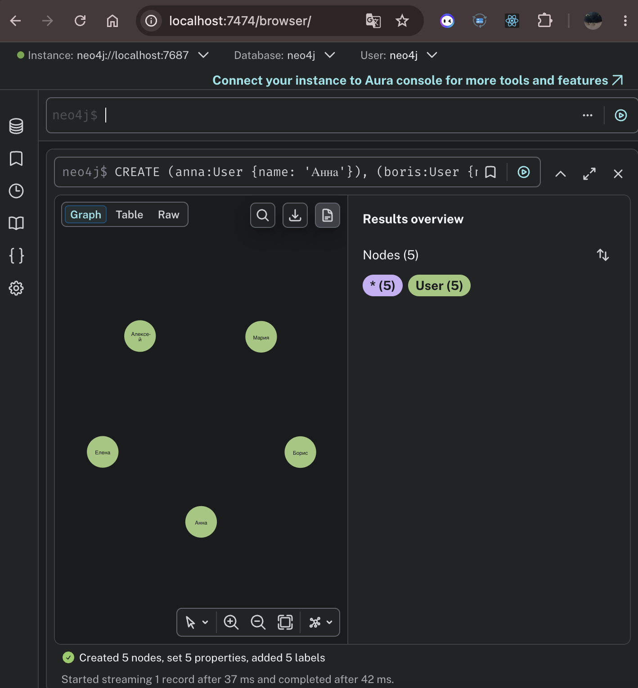
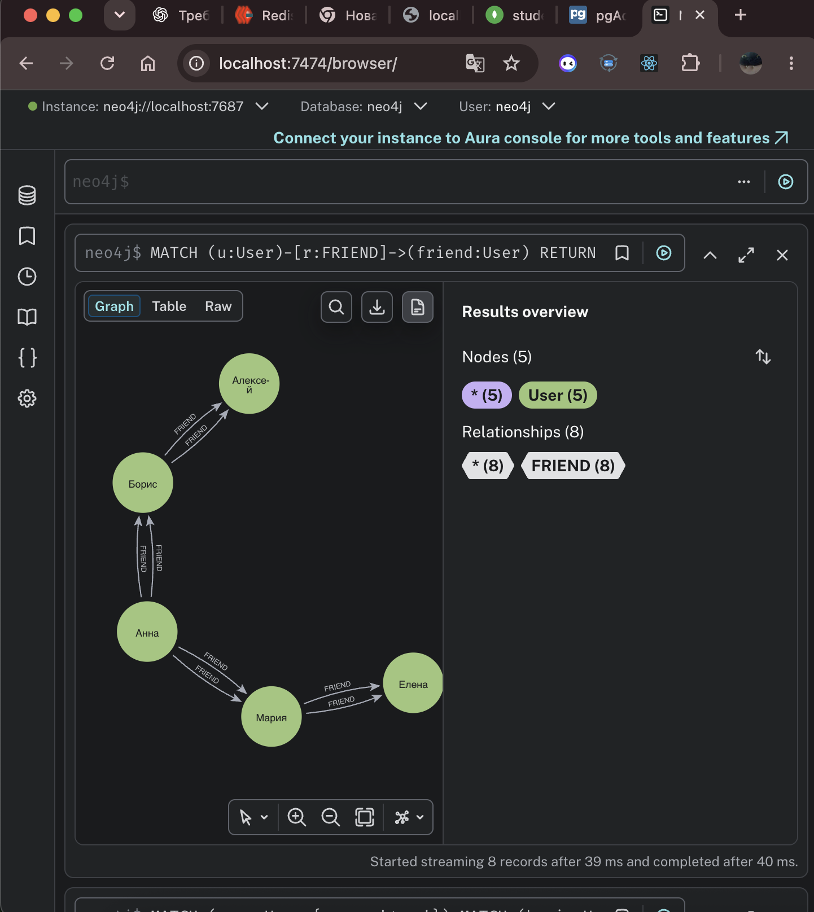
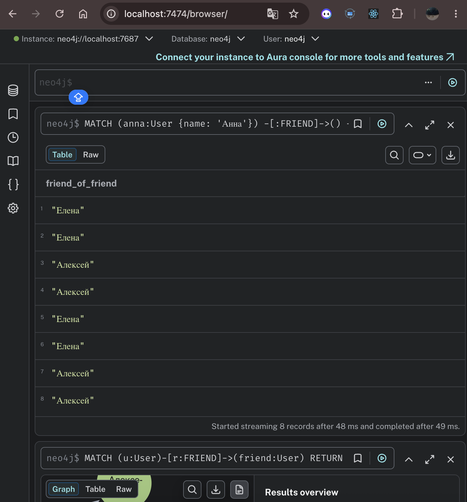
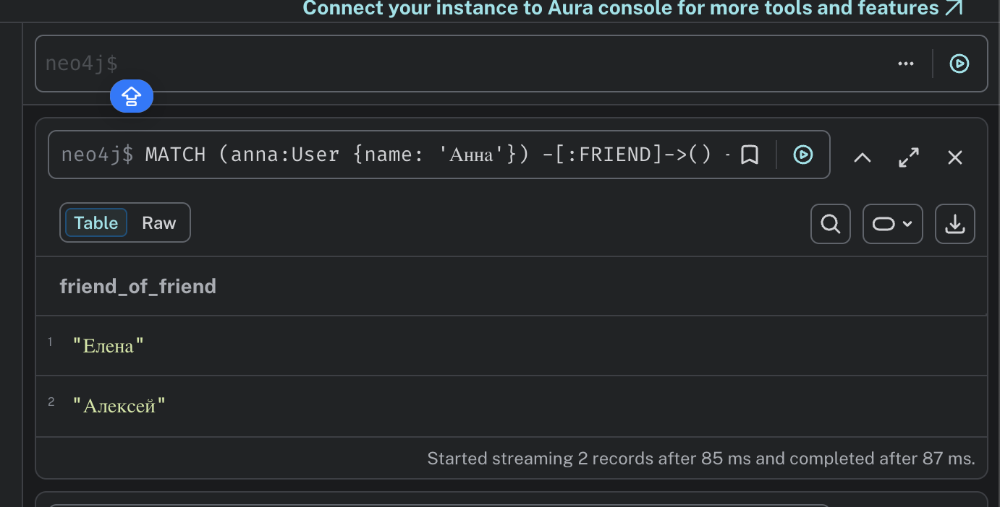
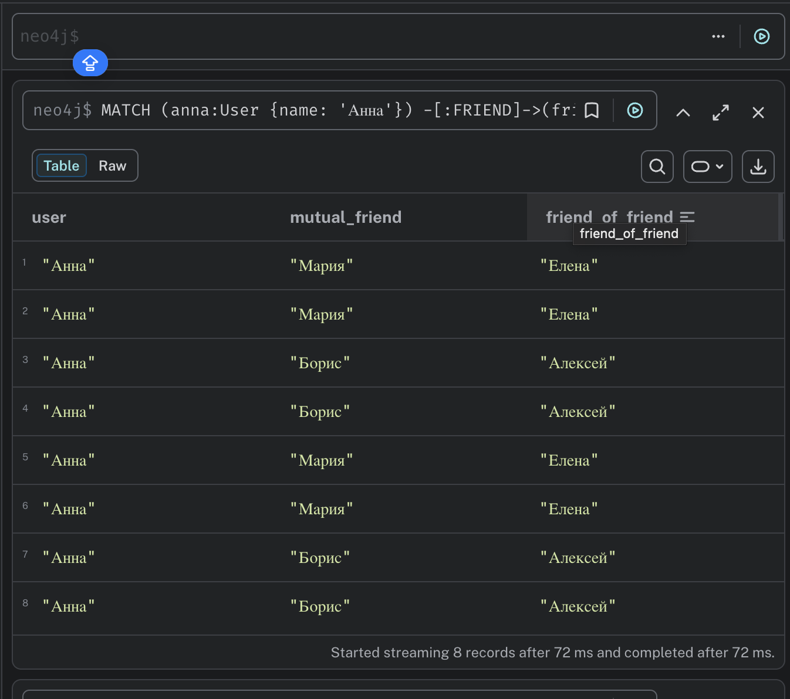
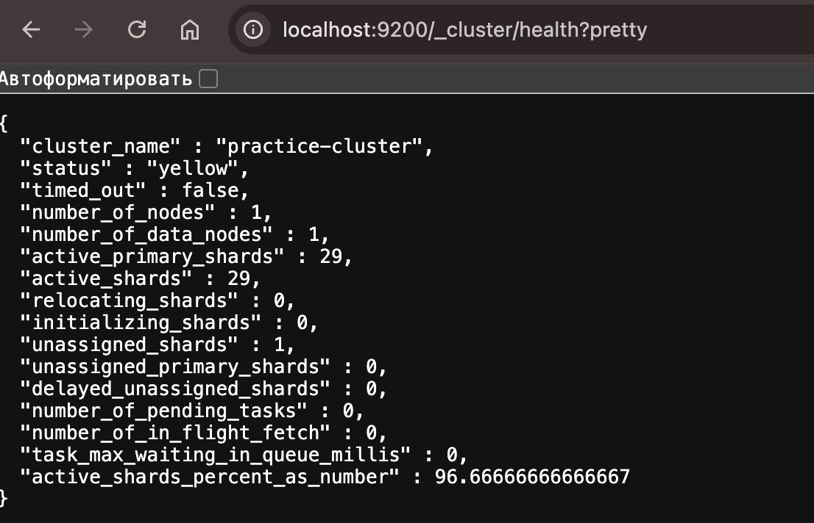
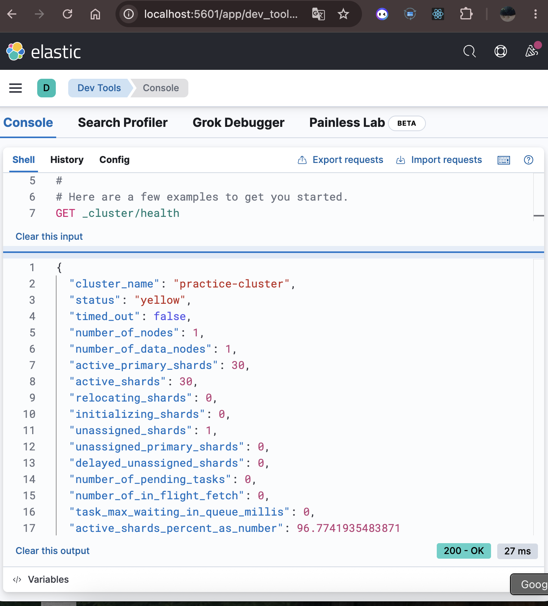
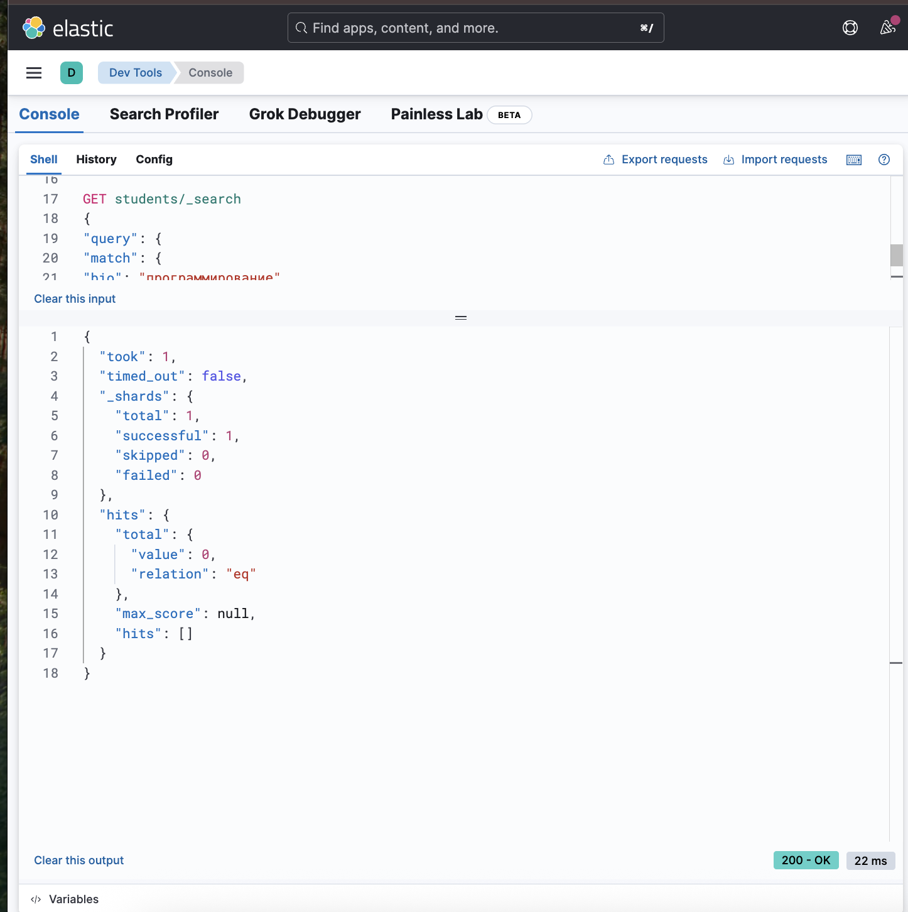
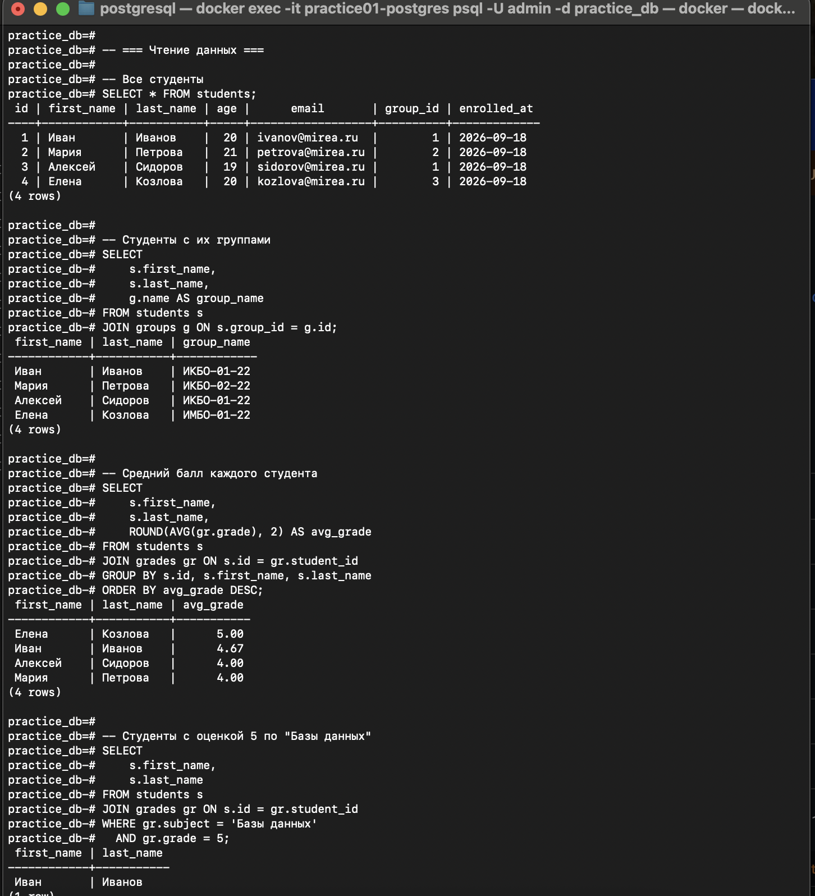

# Практическая работа №1. Развертывание контейнеризированных сред для СУБД

## 1. Redis

### 1.1. Проверка запущенных контейнеров

Команда `docker compose ps` показывает контейнеры текущего Docker Compose-проекта, их состояние и проброшенные порты.

```bash
docker compose ps
```

Вывод команды:

```text
WARN[0000] /Users/p.sinitsina/practice01-databases/redis/docker-compose.yml: the attribute `version` is obsolete, it will be ignored, please remove it to avoid potential confusion 
NAME                         IMAGE                                   COMMAND                  SERVICE           CREATED          STATUS                             PORTS
practice01-redis             redis:7-alpine                          "docker-entrypoint.s…"   redis             37 seconds ago   Up 36 seconds (healthy)            0.0.0.0:6379->6379/tcp, [::]:6379->6379/tcp
practice01-redis-commander   rediscommander/redis-commander:latest   "/usr/bin/dumb-init …"   redis-commander   37 seconds ago   Up 25 seconds (health: starting)   0.0.0.0:8081->8081/tcp, [::]:8081->8081/tcp
```

Контейнер Redis находится в состоянии `Up ... (healthy)`. Redis Commander также запущен; его веб-интерфейс доступен через порт 8081.

### 1.2. Просмотр логов и проверка соединения

Команда `docker compose logs redis` показывает журналы сервиса Redis.

```bash
docker compose logs redis
```

Вывод:

```text
WARN[0000] /Users/p.sinitsina/practice01-databases/redis/docker-compose.yml: the attribute `version` is obsolete, it will be ignored, please remove it to avoid potential confusion 
practice01-redis  | 1:C 18 Sep 2026 14:35:31.713 * oO0OoO0OoO0Oo Redis is starting oO0OoO0OoO0Oo
practice01-redis  | 1:C 18 Sep 2026 14:35:31.713 * Redis version=7.4.11, bits=64, commit=00000000, modified=0, pid=1, just started
practice01-redis  | 1:C 18 Sep 2026 14:35:31.713 * Configuration loaded
practice01-redis  | 1:M 18 Sep 2026 14:35:31.713 * monotonic clock: POSIX clock_gettime
practice01-redis  | 1:M 18 Sep 2026 14:35:31.714 * Running mode=standalone, port=6379.
practice01-redis  | 1:M 18 Sep 2026 14:35:31.715 * Server initialized
practice01-redis  | 1:M 18 Sep 2026 14:35:31.715 * Ready to accept connections tcp
```

Команда `docker exec ... redis-cli ... ping` проверяет, что к Redis можно подключиться и сервер отвечает.

```bash
docker exec practice01-redis redis-cli -a mypassword ping
```

Вывод:

```text
Warning: Using a password with '-a' or '-u' option on the command line interface may not be safe.
PONG
```

### 1.3. Базовые операции с Redis

Подключение к Redis CLI:

```bash
docker exec -it practice01-redis redis-cli -a mypassword
```

Вывод при подключении:

```text
Warning: Using a password with '-a' or '-u' option on the command line interface may not be safe.
```

Команды `SET` и `GET` создают ключ со строковым значением и затем читают его:

```redis
SET mykey "Hello, Redis!"
GET mykey
```

Результат:

```text
OK
"Hello, Redis!"
```

Создание ключа с временем жизни:

```redis
SET session:user1 "token123" EX 3600
TTL session:user1
```

Результат:

```text
OK
(integer) 3596
```

`EX 3600` задаёт срок жизни ключа 3600 секунд, а `TTL` показывает оставшееся время.

Создание Hash:

```redis
HSET user:1 name "Ivanov" age "20" group "IKBO-01-22"
HGETALL user:1
HGET user:1 name
```

Результат:

```text
(integer) 3
1) "name"
2) "Ivanov"
3) "age"
4) "20"
5) "group"
6) "IKBO-01-22"
"Ivanov"
```

Создание списка и просмотр его элементов:

```redis
LPUSH tasks "task1" "task2" "task3"
LRANGE tasks 0 -1
```

Результат:

```text
(integer) 3
1) "task3"
2) "task2"
3) "task1"
```

Создание множества:

```redis
SADD languages "Python" "Java" "Go" "Python"
SMEMBERS languages
```

Результат:

```text
(integer) 3
1) "Python"
2) "Java"
3) "Go"
```

Повторное добавление `Python` не увеличило размер множества, потому что элементы множества уникальны.

Получение списка ключей и количества ключей:

```redis
KEYS *
DBSIZE
```

Результат:

```text
1) "session:user1"
2) "mykey"
3) "languages"
4) "user:1"
5) "tasks"
(integer) 5
```

Команда `INFO server` показывает информацию о Redis-сервере:

```redis
INFO server
```

Полученный вывод:

```text
# Server
redis_version:7.4.11
redis_git_sha1:00000000
redis_git_dirty:0
redis_build_id:dc395baf3ab4da8b
redis_mode:standalone
os:Linux 6.12.72-linuxkit aarch64
arch_bits:64
monotonic_clock:POSIX clock_gettime
multiplexing_api:epoll
atomicvar_api:c11-builtin
gcc_version:14.2.0
process_id:1
process_supervised:no
run_id:c892e743612a635be89c5fb6e7845f54b30ea0a9
tcp_port:6379
server_time_usec:1789742742173211
uptime_in_seconds:611
uptime_in_days:0
hz:10
configured_hz:10
lru_clock:11357846
executable:/data/redis-server
config_file:
io_threads_active:0
listener0:name=tcp,bind=*,bind=-::*,port=6379
```

Выход из Redis CLI:

```redis
EXIT
```

### 1.4. Веб-интерфейс Redis Commander

На скриншоте показан веб-интерфейс Redis Commander с созданными ключами Redis.


---

## 2. MongoDB

### 2.1. Запуск MongoDB и Mongo Express

Команды запускают контейнеры и показывают их состояние:

```bash
docker compose up -d
docker compose ps
```

Вывод:

```text
WARN[0000] /Users/p.sinitsina/practice01-databases/mongodb/docker-compose.yml: the attribute `version` is obsolete, it will be ignored, please remove it to avoid potential confusion 
[+] up 26/26
 ✔ Image mongo-express:1-20-alpine3.19 Pulled                                                                   43.8ss
 ✔ Image mongo:7                       Pulled                                                                   394.9s
 ✔ Network mongodb_default             Created                                                                  0.0s
 ✔ Volume mongodb_mongodb_data         Created                                                                  0.0s
 ✔ Container practice01-mongodb        Healthy                                                                  11.2s
 ✔ Container practice01-mongo-express  Created                                                                  0.1s
WARN[0000] /Users/p.sinitsina/practice01-databases/mongodb/docker-compose.yml: the attribute `version` is obsolete, it will be ignored, please remove it to avoid potential confusion 
NAME                       IMAGE                           COMMAND                  SERVICE         CREATED          STATUS                    PORTS
practice01-mongo-express   mongo-express:1-20-alpine3.19   "/sbin/tini -- /dock…"   mongo-express   11 seconds ago   Up Less than a second     0.0.0.0:8082->8081/tcp, [::]:8082->8081/tcp
practice01-mongodb         mongo:7                         "docker-entrypoint.s…"   mongodb         12 seconds ago   Up 10 seconds (healthy)   0.0.0.0:27017->27017/tcp, [::]:27017->27017/tcp
```

MongoDB находится в состоянии `healthy`, а Mongo Express доступен через порт 8082.

Проверка подключения к MongoDB:

```bash
docker exec practice01-mongodb mongosh -u admin -p secret --authenticationDatabase admin --eval "db.runCommand({ping: 1})"
```

Результат:

```text
{ ok: 1 }
```

Это означает, что сервер MongoDB отвечает.

### 2.2. Веб-интерфейс Mongo Express

Скриншот показывает Mongo Express и просмотр данных коллекции в веб-интерфейсе.


---

## 3. Neo4j

### 3.1. Запуск и проверка Neo4j

В исходной сессии использовался просмотр логов контейнера:

```bash
docker compose logs -f neo4j
```

Вывод:

```text
WARN[0000] /Users/p.sinitsina/practice01-databases/neo4j/docker-compose.yml: the attribute `version` is obsolete, it will be ignored, please remove it to avoid potential confusion 
practice01-neo4j  | Changed password for user 'neo4j'. IMPORTANT: this change will only take effect if performed before the database is started for the first time.
practice01-neo4j  | 2026-09-18 15:02:36.110+0000 INFO  Logging config in use: File '/var/lib/neo4j/conf/user-logs.xml'
practice01-neo4j  | 2026-09-18 15:02:36.120+0000 INFO  Starting...
practice01-neo4j  | 2026-09-18 15:02:36.744+0000 INFO  This instance is ServerId{7125f60d} (7125f60d-2603-4d8c-8275-dda59e267e7d)
practice01-neo4j  | 2026-09-18 15:02:37.503+0000 INFO  ======== Neo4j 5.26.30 ========
practice01-neo4j  | 2026-09-18 15:02:38.982+0000 INFO  Anonymous Usage Data is being sent to Neo4j, see https://neo4j.com/docs/usage-data/
practice01-neo4j  | 2026-09-18 15:02:39.028+0000 INFO  Bolt enabled on 0.0.0.0:7687.
practice01-neo4j  | 2026-09-18 15:02:40.158+0000 INFO  HTTP enabled on 0.0.0.0:7474.
practice01-neo4j  | 2026-09-18 15:02:40.158+0000 INFO  Remote interface available at http://localhost:7474/
practice01-neo4j  | 2026-09-18 15:02:40.160+0000 INFO  id: 33BC78C9379503742CA897FE2A4EF36900E81D8A64A043E8A992CE1BB0BF9132
practice01-neo4j  | 2026-09-18 15:02:40.160+0000 INFO  name: system
practice01-neo4j  | 2026-09-18 15:02:40.160+0000 INFO  creationDate: 2026-09-18T15:02:38.288Z
practice01-neo4j  | 2026-09-18 15:02:40.160+0000 INFO  Started.
```

Остановка просмотра логов выполнялась `Ctrl+C`.

Проверка HTTP-интерфейса:

```bash
curl http://localhost:7474
```

Ответ:

```text
{"bolt_routing":"neo4j://localhost:7687","query":"http://localhost:7474/db/{databaseName}/query/v2","transaction":"http://localhost:7474/db/{databaseName}/tx","bolt_direct":"bolt://localhost:7687","neo4j_version":"5.26.30","neo4j_edition":"community"}
```

### 3.2. Создание студентов и курсов

Создание первого студента:

```cypher
CREATE (s:Student {name: "Иванов Иван", age: 20, group:
             "ИКБО-01-22"})
             RETURN s;
```

Результат:

```text
+----------------------------------------------------------------+
| s                                                              |
+----------------------------------------------------------------+
| (:Student {name: "Иванов Иван", age: 20, group: "ИКБО-01-22"}) |
+----------------------------------------------------------------+

1 row
ready to start consuming query after 136 ms, results consumed after another 16 ms
Added 1 nodes, Set 3 properties, Added 1 labels
```

Создание ещё двух студентов и трёх курсов:

```cypher
CREATE (s1:Student {name: "Петрова Мария", age: 21, group:
             "ИКБО-02-22"}),
       (s2:Student {name: "Сидоров Алексей", age: 19, group:
             "ИКБО-01-22"}),
       (c1:Course {title: "Базы данных", credits: 4}),
       (c2:Course {title: "Программирование", credits: 5}),
       (c3:Course {title: "Математика", credits: 6});
```

Результат:

```text
0 rows
ready to start consuming query after 74 ms, results consumed after another 0 ms
Added 5 nodes, Set 12 properties, Added 5 labels
```

### 3.3. Создание связей студент — курс

Связь Иванова Ивана с курсом «Базы данных»:

```cypher
MATCH (s:Student {name: "Иванов Иван"}), (c:Course {title: "Базы
             данных"})
             CREATE (s)-[:ENROLLED_IN {grade: 5, semester: "весна 2024"}]->
             (c)
             RETURN s, c;
```

Результат исходной сессии:

```text
+-------+
| s | c |
+-------+
+-------+

0 rows
ready to start consuming query after 208 ms, results consumed after another 3 ms
```

Следующая связь — Иванов Иван и «Программирование»:

```cypher
MATCH (s:Student {name: "Иванов Иван"}), (c:Course {title:
             "Программирование"})
             CREATE (s)-[:ENROLLED_IN {grade: 5, semester: "весна 2024"}]->
             (c);
```

Результат:

```text
0 rows
ready to start consuming query after 74 ms, results consumed after another 0 ms
Created 1 relationships, Set 2 properties
```

Связь Петровой Марии с «Базы данных»:

```cypher
MATCH (s:Student {name: "Петрова Мария"}), (c:Course {title:
             "Базы данных"})
             CREATE (s)-[:ENROLLED_IN {grade: 4, semester: "весна 2024"}]->
             (c);
```

Результат:

```text
0 rows
ready to start consuming query after 27 ms, results consumed after another 0 ms
Created 1 relationships, Set 2 properties
```

Связь Петровой Марии с «Математика»:

```cypher
MATCH (s:Student {name: "Петрова Мария"}), (c:Course {title:
             "Математика"})
             CREATE (s)-[:ENROLLED_IN {grade: 5, semester: "в�сна 2024"}]->
             (c);
```

Результат исходной сессии:

```text
0 rows
ready to start consuming query after 47 ms, results consumed after another 0 ms
Created 1 relationships, Set 2 properties
```

В исходном текстовом файле в этой строке встречается символ `�`; он оставлен без исправления, чтобы сохранить исходную запись сессии.

Дополнительная связь дружбы между студентами:

```cypher
MATCH (s1:Student {name: "Иванов Ив�н"}), (s2:Student {name:
             "Сидоров Алексей"})
             CREATE (s1)-[:FRIENDS_WITH {since: "2022-09-01"}]->(s2);
```

Исходный результат:

```text
0 rows
ready to start consuming query after 49 ms, results consumed after another 0 ms
```

### 3.4. Запросы к графу

Получение всех студентов:

```cypher
MATCH (s:Student) RETURN s;
```

Результат:

```text
+--------------------------------------------------------------------+
| s                                                                  |
+--------------------------------------------------------------------+
| (:Student {name: "Иванов Иван", age: 20, group: "ИКБО-01-22"})     |
| (:Student {name: "Петрова Мария", age: 21, group: "ИКБО-02-22"})   |
| (:Student {name: "Сидоров Алексей", age: 19, group: "ИКБО-01-22"}) |
+--------------------------------------------------------------------+

3 rows
ready to start consuming query after 37 ms, results consumed after another 1 ms
```

Получение всех связей:

```cypher
MATCH (n)-[r]->(m) RETURN n, r, m;
```

Результат:

```text
+--------------------------------------------------------------------------------------------------------------------------------------------------------------------------+
| n                                                                | r                                                 | m                                                 |
+--------------------------------------------------------------------------------------------------------------------------------------------------------------------------+
| (:Student {name: "Иванов Иван", age: 20, group: "ИКБО-01-22"})   | [:ENROLLED_IN {semester: "весна 2024", grade: 5}] | (:Course {title: "Программирование", credits: 5}) |
| (:Student {name: "Петрова Мария", age: 21, group: "ИКБО-02-22"}) | [:ENROLLED_IN {semester: "весна 2024", grade: 4}] | (:Course {title: "Базы данных", credits: 4})      |
| (:Student {name: "Петрова Мария", age: 21, group: "ИКБО-02-22"}) | [:ENROLLED_IN {semester: "в�сна 2024", grade: 5}] | (:Course {title: "Математика", credits: 6})       |
+--------------------------------------------------------------------------------------------------------------------------------------------------------------------------+

3 rows
ready to start consuming query after 66 ms, results consumed after another 2 ms
```

Курсы, записанные за Ивановым Иваном:

```cypher
MATCH (s:Student {name: "Иванов Иван"})-[r:ENROLLED_IN]->
             (c:Course)
             RETURN c.title AS course, r.grade AS grade;
```

Результат:

```text
+----------------------------+
| course             | grade |
+----------------------------+
| "Программирование" | 5     |
+----------------------------+

1 row
ready to start consuming query after 71 ms, results consumed after another 2 ms
```

Поиск студентов, записанных на «Базы данных»:

```cypher
MATCH (s:Student)-[:ENROLLED_IN]->(c:Course {title: "Базы
             данных"})
             RETURN s.name AS student, s.group AS studentGroup;
```

Результат:

```text
+------------------------+
| student | studentGroup |
+------------------------+
+------------------------+

0 rows
ready to start consuming query after 66 ms, results consumed after another 3 ms
```

Поиск друзей на расстоянии до двух связей:

```cypher
MATCH (s:Student {name: "Иванов Иван"})-[:FRIENDS_WITH*1..2]-
             (friend:Student)
             RETURN friend.name AS friendName;
```

Результат:

```text
+------------+
| friendName |
+------------+
+------------+

0 rows
ready to start consuming query after 75 ms, results consumed after another 4 ms
```

Количество студентов по каждому курсу:

```cypher
MATCH (s:Student)-[:ENROLLED_IN]->(c:Course)
             RETURN c.title AS course, count(s) AS studentCount
             ORDER BY studentCount DESC;
```

Результат:

```text
+-----------------------------------+
| course             | studentCount |
+-----------------------------------+
| "Программирование" | 1            |
| "Базы данных"      | 1            |
| "Математика"       | 1            |
+-----------------------------------+

3 rows
ready to start consuming query after 108 ms, results consumed after another 5 ms
```

### 3.5. Скриншоты Neo4j













Примечание: изображения `neo4j_1.png`–`neo4j_5.png` относятся к отдельной визуализации социальной сети. В исходном `1_1.md` для этого блока текстовых команд нет, там указано только `скрины`; поэтому изображения сохранены как иллюстрации без добавления отсутствующих команд.

---

## 4. Elasticsearch

### 4.1. Проверка Elasticsearch

`docker compose ps` показывает состояние Elasticsearch и Kibana.

```bash
docker compose ps
```

Вывод:

```text
WARN[0000] /Users/p.sinitsina/practice01-databases/elasticsearch/docker-compose.yml: the attribute `version` is obsolete, it will be ignored, please remove it to avoid potential confusion 
NAME                       IMAGE                  COMMAND                  SERVICE         CREATED             STATUS                       PORTS
practice01-elasticsearch   elasticsearch:8.16.0   "/bin/tini -- /usr/l…"   elasticsearch   About an hour ago   Up About an hour (healthy)   0.0.0.0:9200->9200/tcp, [::]:9200->9200/tcp, 0.0.0.0:9300->9300/tcp, [::]:9300->9300/tcp
practice01-kibana          kibana:8.16.0          "/bin/tini -- /usr/l…"   kibana          About an hour ago   Up About an hour             0.0.0.0:5601->5601/tcp, [::]:5601->5601/tcp
```

Проверка информации о сервере:

```bash
curl http://localhost:9200
```

Ответ:

```text
{
  "name" : "es-node-1",
  "cluster_name" : "practice-cluster",
  "cluster_uuid" : "7lojM8PSQlaeZr5JfnOebw",
  "version" : {
    "number" : "8.16.0",
    "build_flavor" : "default",
    "build_type" : "docker",
    "build_hash" : "12ff76a92922609df4aba61a368e7adf65589749",
    "build_date" : "2024-11-08T10:05:56.292914697Z",
    "build_snapshot" : false,
    "lucene_version" : "9.12.0",
    "minimum_wire_compatibility_version" : "7.17.0",
    "minimum_index_compatibility_version" : "7.0.0"
  },
  "tagline" : "You Know, for Search"
}
```

Проверка состояния кластера:

```bash
curl http://localhost:9200/_cluster/health\?pretty
```

Результат:

```text
{
  "cluster_name" : "practice-cluster",
  "status" : "yellow",
  "timed_out" : false,
  "number_of_nodes" : 1,
  "number_of_data_nodes" : 1,
  "active_primary_shards" : 29,
  "active_shards" : 29,
  "relocating_shards" : 0,
  "initializing_shards" : 0,
  "unassigned_shards" : 1,
  "unassigned_primary_shards" : 0,
  "delayed_unassigned_shards" : 0,
  "number_of_pending_tasks" : 0,
  "number_of_in_flight_fetch" : 0,
  "task_max_waiting_in_queue_millis" : 0,
  "active_shards_percent_as_number" : 96.66666666666667
}
```

Состояние `yellow` в исходной сессии связано с наличием одного `unassigned`-shard; при этом `unassigned_primary_shards` равно 0.



### 4.2. Создание индекса `students`

Команда создаёт индекс `students` с настройками шардов и схемой полей.

```bash
curl -X PUT "http://localhost:9200/students" \
  -H "Content-Type: application/json" \
  -d '{
    "settings": {
      "number_of_shards": 1,
      "number_of_replicas": 0
    },
    "mappings": {
      "properties": {
        "name": {
          "type": "text",
          "analyzer": "standard"
        },
        "age": {
          "type": "integer"
        },
        "group": {
          "type": "keyword"
        },
        "bio": {
          "type": "text"
        },
        "enrolled_at": {
          "type": "date"
        }
      }
    }
  }'
```

Результат:

```text
{"acknowledged":true,"shards_acknowledged":true,"index":"students"}
```

Здесь `name` и `bio` имеют тип `text`, `group` — `keyword`, `age` — `integer`, `enrolled_at` — `date`.

### 4.3. Индексация документов

Добавление первого документа с автоматически сгенерированным ID:

```bash
curl -X POST "http://localhost:9200/students/_doc" \
  -H "Content-Type: application/json" \
  -d '{
    "name": "Иванов Иван Иванович",
    "age": 20,
    "group": "ИКБО-01-22",
    "bio": "Студент третьего курса, увлекается программированием и машинным обучением",
    "enrolled_at": "2022-09-01"
  }'
```

Результат:

```text
{"_index":"students","_id":"06jfuKABi9VCmUItUgBD","_version":1,"result":"created","_shards":{"total":1,"successful":1,"failed":0},"_seq_no":0,"_primary_term":1}
```

Добавление второго документа с ID `2`:

```bash
curl -X PUT "http://localhost:9200/students/_doc/2" \
  -H "Content-Type: application/json" \
  -d '{
    "name": "Петрова Мария Сергеевна",
    "age": 21,
    "group": "ИКБО-02-22",
    "bio": "Студентка, занимается анализом данных и визуализацией",
    "enrolled_at": "2022-09-01"
  }'
```

Результат:

```text
{"_index":"students","_id":"2","_version":1,"result":"created","_shards":{"total":1,"successful":1,"failed":0},"_seq_no":1,"_primary_term":1}
```

Добавление третьего документа с ID `3`:

```bash
curl -X PUT "http://localhost:9200/students/_doc/3" \
  -H "Content-Type: application/json" \
  -d '{
    "name": "Сидоров Алексей Петрович",
    "age": 19,
    "group": "ИКБО-01-22",
    "bio": "Первокурсник, интересуется веб-разработкой и базами данных",
    "enrolled_at": "2023-09-01"
  }'
```

Результат:

```text
{"_index":"students","_id":"3","_version":1,"result":"created","_shards":{"total":1,"successful":1,"failed":0},"_seq_no":2,"_primary_term":1}
```

### 4.4. Поиск всех документов

```bash
curl "http://localhost:9200/students/_search?pretty"
```

В результате найдено 3 документа:

```text
"hits" : {
  "total" : {
    "value" : 3,
    "relation" : "eq"
  },
  "max_score" : 1.0
}
```

Один из возвращённых документов:

```text
"_index" : "students",
"_id" : "06jfuKABi9VCmUItUgBD",
"_score" : 1.0,
"_source" : {
  "name" : "Иванов Иван Иванович",
  "age" : 20,
  "group" : "ИКБО-01-22",
  "bio" : "Студент третьего курса, увлекается программированием и машинным обучением",
  "enrolled_at" : "2022-09-01"
}
```

### 4.5. Полнотекстовый поиск

Поиск по полю `bio` выполняется с помощью `match`.

```bash
curl -X GET "http://localhost:9200/students/_search?pretty" \
  -H "Content-Type: application/json" \
  -d '{
    "query": {
      "match": {
        "bio": "программирование"
      }
    }
  }'
```

Фактический результат из исходной сессии:

```text
"hits" : {
  "total" : {
    "value" : 0,
    "relation" : "eq"
  },
  "max_score" : null,
  "hits" : [ ]
}
```

Таким образом, данный запрос в сохранённой сессии вернул 0 результатов. Этот вывод сохранён без изменения.

Поиск по слову `студент`:

```bash
curl -X GET "http://localhost:9200/students/_search?pretty" \
  -H "Content-Type: application/json" \
  -d '{
    "query": {
      "match": {
        "bio": "студент"
      }
    }
  }'
```

Фактический результат:

```text
"hits" : {
  "total" : {
    "value" : 1,
    "relation" : "eq"
  },
  "max_score" : 0.92667305,
  "hits" : [
    {
      "_index" : "students",
      "_id" : "06jfuKABi9VCmUItUgBD",
      "_score" : 0.92667305,
      "_source" : {
        "name" : "Иванов Иван Иванович",
        "age" : 20,
        "group" : "ИКБО-01-22",
        "bio" : "Студент третьего курса, увлекается программированием и машинным обучением",
        "enrolled_at" : "2022-09-01"
      }
    }
  ]
}
```

Здесь хорошо виден `_score`, который Elasticsearch рассчитывает для найденного документа.

### 4.6. Точный поиск по `keyword`

Поиск студентов из группы `ИКБО-01-22`:

```bash
curl -X GET "http://localhost:9200/students/_search?pretty" \
  -H "Content-Type: application/json" \
  -d '{
    "query": {
      "term": {
        "group": "ИКБО-01-22"
      }
    }
  }'
```

Результат:

```text
"hits" : {
  "total" : {
    "value" : 2,
    "relation" : "eq"
  },
  "max_score" : 0.4700036,
  "hits" : [
    {
      "_index" : "students",
      "_id" : "06jfuKABi9VCmUItUgBD",
      "_score" : 0.4700036,
      "_source" : {
        "name" : "Иванов Иван Иванович",
        "age" : 20,
        "group" : "ИКБО-01-22",
        "bio" : "Студент третьего курса, увлекается программированием и машинным обучением",
        "enrolled_at" : "2022-09-01"
      }
    },
    {
      "_index" : "students",
      "_id" : "3",
      "_score" : 0.4700036,
      "_source" : {
        "name" : "Сидоров Алексей Петрович",
        "age" : 19,
        "group" : "ИКБО-01-22",
        "bio" : "Первокурсник, интересуется веб-разработкой и базами данных",
        "enrolled_at" : "2023-09-01"
      }
    }
  ]
}
```

### 4.7. Комбинированный запрос `bool`

Поиск студентов группы `ИКБО-01-22` старше 19 лет:

```bash
curl -X GET "http://localhost:9200/students/_search?pretty" \
  -H "Content-Type: application/json" \
  -d '{
    "query": {
      "bool": {
        "must": [
          {
            "term": {
              "group": "ИКБО-01-22"
            }
          },
          {
            "range": {
              "age": {
                "gt": 19
              }
            }
          }
        ]
      }
    }
  }'
```

Результат:

```text
"hits" : {
  "total" : {
    "value" : 1,
    "relation" : "eq"
  },
  "max_score" : 1.4700036,
  "hits" : [
    {
      "_index" : "students",
      "_id" : "06jfuKABi9VCmUItUgBD",
      "_score" : 1.4700036,
      "_source" : {
        "name" : "Иванов Иван Иванович",
        "age" : 20,
        "group" : "ИКБО-01-22",
        "bio" : "Студент третьего курса, увлекается программированием и машинным обучением",
        "enrolled_at" : "2022-09-01"
      }
    }
  ]
}
```

### 4.8. Агрегация

Подсчёт количества студентов в каждой группе:

```bash
curl -X GET "http://localhost:9200/students/_search?pretty" \
  -H "Content-Type: application/json" \
  -d '{
    "size": 0,
    "aggs": {
      "students_per_group": {
        "terms": {
          "field": "group"
        }
      }
    }
  }'
```

Результат:

```text
"aggregations" : {
  "students_per_group" : {
    "doc_count_error_upper_bound" : 0,
    "sum_other_doc_count" : 0,
    "buckets" : [
      {
        "key" : "ИКБО-01-22",
        "doc_count" : 2
      },
      {
        "key" : "ИКБО-02-22",
        "doc_count" : 1
      }
    ]
  }
}
```

### 4.9. Информация об индексе и количестве документов

Список индексов:

```bash
curl "http://localhost:9200/_cat/indices?v"
```

Фрагмент вывода для `students`:

```text
green  open   students   A3e5kG-MQnWejTROMxMheg   1   0   3   0   16.9kb   16.9kb   16.9kb
```

Проверка mapping:

```bash
curl "http://localhost:9200/students/_mapping?pretty"
```

Результат:

```text
"properties" : {
  "age" : {
    "type" : "integer"
  },
  "bio" : {
    "type" : "text"
  },
  "enrolled_at" : {
    "type" : "date"
  },
  "group" : {
    "type" : "keyword"
  },
  "name" : {
    "type" : "text",
    "analyzer" : "standard"
  }
}
```

Подсчёт документов:

```bash
curl "http://localhost:9200/students/_count?pretty"
```

Результат:

```text
{
  "count" : 3,
  "_shards" : {
    "total" : 1,
    "successful" : 1,
    "skipped" : 0,
    "failed" : 0
  }
}
```

### 4.10. Kibana: Dev Tools и Discover

На скриншотах показана работа с Elasticsearch через Kibana Dev Tools: выполнение запросов и просмотр результатов.





На следующем изображении сохранён результат полнотекстового поиска, который в исходной сессии вернул 0 результатов.



В Discover был создан Data View `students`, после чего документы индекса были доступны для просмотра через Kibana.


---

## 5. PostgreSQL

Выполненные SQL-запросы и их результаты приведены ниже.

### 5.1. Получение всех студентов

```sql
SELECT * FROM students;
```

Результат:

```text
 id | first_name | last_name | age |      email       | group_id | enrolled_at 
----+------------+-----------+-----+------------------+----------+-------------
  1 | Иван       | Иванов    |  20 | ivanov@mirea.ru  |        1 | 2026-09-18
  2 | Мария      | Петрова   |  21 | petrova@mirea.ru |        2 | 2026-09-18
  3 | Алексей    | Сидоров   |  19 | sidorov@mirea.ru |        1 | 2026-09-18
  4 | Елена      | Козлова   |  20 | kozlova@mirea.ru |        3 | 2026-09-18
(4 rows)
```

### 5.2. Студенты и их группы

```sql
SELECT 
    s.first_name,
    s.last_name,
    g.name AS group_name
FROM students s
JOIN groups g ON s.group_id = g.id;
```

Результат:

```text
 first_name | last_name | group_name 
------------+-----------+------------
 Иван       | Иванов    | ИКБО-01-22
 Мария      | Петрова   | ИКБО-02-22
 Алексей    | Сидоров   | ИКБО-01-22
 Елена      | Козлова   | ИМБО-01-22
(4 rows)
```

### 5.3. Средний балл студентов

```sql
SELECT 
    s.first_name,
    s.last_name,
    ROUND(AVG(gr.grade), 2) AS avg_grade
FROM students s
JOIN grades gr ON s.id = gr.student_id
GROUP BY s.id, s.first_name, s.last_name
ORDER BY avg_grade DESC;
```

Результат:

```text
 first_name | last_name | avg_grade 
------------+-----------+-----------
 Елена      | Козлова   |      5.00
 Иван       | Иванов    |      4.67
 Алексей    | Сидоров   |      4.00
 Мария      | Петрова   |      4.00
(4 rows)
```

### 5.4. Студенты с оценкой 5 по «Базы данных»

```sql
SELECT 
    s.first_name,
    s.last_name
FROM students s
JOIN grades gr ON s.id = gr.student_id
WHERE gr.subject = 'Базы данных'
  AND gr.grade = 5;
```

Результат:

```text
 first_name | last_name 
------------+-----------
 Иван       | Иванов
(1 row)
```

### 5.5. Количество студентов в каждой группе

```sql
SELECT 
    g.name,
    COUNT(s.id) AS student_count
FROM groups g
LEFT JOIN students s ON g.id = s.group_id
GROUP BY g.name;
```

Результат:

```text
    name    | student_count 
------------+---------------
 ИКБО-02-22 |             1
 ИМБО-01-22 |             1
 ИКБО-01-22 |             2
(3 rows)
```

### 5.6. Обновление данных

Возраст Иванова Ивана изменён на 21:

```sql
UPDATE students
SET age = 21
WHERE first_name = 'Иван'
  AND last_name = 'Иванов';
```

Результат:

```text
UPDATE 1
```

### 5.7. Скриншот PostgreSQL



---

# 6. Задания для самостоятельной работы (пункт 8)

В соответствии с заданием из методических материалов самостоятельная работа состоит из шести пунктов. Ниже сначала приведены формулировки заданий, а затем — фактическое выполнение, команды и выводы из предоставленных файлов `1.md` и `1_1.md`.

## 6.1. Изменение паролей во всех конфигурациях

**Задание:** изменить пароли во всех конфигурациях и убедиться, что все сервисы продолжают работать корректно.

В предоставленном файле `1_1.md` отдельный протокол выполнения этого пункта отсутствует. Поэтому команды и результаты для изменения паролей в отчёте не добавляются, чтобы не придумывать отсутствующие данные.

## 6.2. PostgreSQL: скрипт инициализации базы данных

**Задание:** создать скрипт инициализации `.sql`, который автоматически создаёт таблицы и вставляет тестовые данные при первом запуске контейнера PostgreSQL. Подключить скрипт через volume к директории `/docker-entrypoint-initdb.d`.

В предоставленном файле `1_1.md` отдельного выполнения этого пункта нет. В основной части работы PostgreSQL-запросы выполнялись непосредственно в базе данных; этот результат сохранён в разделе PostgreSQL выше.

## 6.3. MongoDB: вложенные документы и агрегация

**Задание:** создать коллекцию с вложенными документами, например заказы с товарами, и выполнить агрегационный запрос для подсчёта суммы заказов.

Выполнение этого пункта из `1_1.md` приведено ниже.

### 6.3.1. Переключение на базу данных


Переключение на `practice_db`:

```javascript
use practice_db
```

Результат:

```text
switched to db practice_db
```

Создание коллекции `orders` с вложенными документами `items`:

```javascript
db.orders.insertMany([
  {
    order_id: 1,
    customer: "Иванов Иван",
    items: [
      { name: "Ноутбук", quantity: 1, price: 80000 },
      { name: "Мышь", quantity: 2, price: 2500 }
    ]
  },
  {
    order_id: 2,
    customer: "Петров Петр",
    items: [
      { name: "Клавиатура", quantity: 1, price: 5000 },
      { name: "Монитор", quantity: 2, price: 30000 }
    ]
  },
  {
    order_id: 3,
    customer: "Сидоров Алексей",
    items: [
      { name: "Наушники", quantity: 1, price: 7000 },
      { name: "Веб-камера", quantity: 1, price: 6000 }
    ]
  }
])
```

Результат:

```text
{
  acknowledged: true,
  insertedIds: {
    '0': ObjectId('6aad77e5ae6e620a1f643289'),
    '1': ObjectId('6aad77e5ae6e620a1f64328a'),
    '2': ObjectId('6aad77e5ae6e620a1f64328b')
  }
}
```

Агрегация для вычисления суммы каждого заказа:

```javascript
db.orders.aggregate([
  {
    $project: {
      _id: 0,
      order_id: 1,
      customer: 1,
      total: {
        $sum: {
          $map: {
            input: "$items",
            as: "item",
            in: {
              $multiply: ["$$item.quantity", "$$item.price"]
            }
          }
        }
      }
    }
  }
])
```

Результат:

```text
[
  { order_id: 1, customer: 'Иванов Иван', total: 85000 },
  { order_id: 2, customer: 'Петров Петр', total: 65000 },
  { order_id: 3, customer: 'Сидоров Алексей', total: 13000 }
]
```

Просмотр документов коллекции:

```javascript
db.orders.find().pretty()
```

Результат:

```text
[
  {
    _id: ObjectId('6aad77e5ae6e620a1f643289'),
    order_id: 1,
    customer: 'Иванов Иван',
    items: [
      { name: 'Ноутбук', quantity: 1, price: 80000 },
      { name: 'Мышь', quantity: 2, price: 2500 }
    ]
  },
  {
    _id: ObjectId('6aad77e5ae6e620a1f64328a'),
    order_id: 2,
    customer: 'Петров Петр',
    items: [
      { name: 'Клавиатура', quantity: 1, price: 5000 },
      { name: 'Монитор', quantity: 2, price: 30000 }
    ]
  },
  {
    _id: ObjectId('6aad77e5ae6e620a1f64328b'),
    order_id: 3,
    customer: 'Сидоров Алексей',
    items: [
      { name: 'Наушники', quantity: 1, price: 7000 },
      { name: 'Веб-камера', quantity: 1, price: 6000 }
    ]
  }
]
```

В результате для трёх заказов рассчитаны суммы 85 000, 65 000 и 13 000 соответственно.

## 6.4. Redis: счётчик посещений и TTL

**Задание:** реализовать простой счётчик посещений с помощью команды `INCR`, установить TTL на ключ и проследить за его удалением.


Подключение к Redis:

```bash
docker exec -it practice01-redis redis-cli -a mypassword
```

Создание счётчика:

```redis
SET visits 0
INCR visits
INCR visits
INCR visits
GET visits
```

Результат:

```text
OK
(integer) 1
(integer) 2
(integer) 3
"3"
```

Установка времени жизни ключа 30 секунд:

```redis
EXPIRE visits 30
TTL visits
```

Результат:

```text
(integer) 1
(integer) 26
```

Проверка существования ключа до истечения TTL:

```redis
EXISTS visits
```

Результат:

```text
(integer) 1
```

После истечения времени жизни:

```redis
EXISTS visits
GET visits
```

Результат:

```text
(integer) 0
(nil)
```

Это показывает автоматическое удаление ключа после окончания TTL.

## 6.5. Neo4j: граф социальной сети

**Задание:** создать граф социальной сети, состоящий из пользователей и связей «дружбы». Написать Cypher-запрос для поиска «друзей друзей» с исключением уже существующих друзей.


В исходном `1_1.md` для этого подпункта указана только запись `скрины`, без дополнительных текстовых команд. В архиве есть следующие изображения, поэтому они включены в объединённый отчёт:


## 6.6. Elasticsearch: текстовые документы и полнотекстовый поиск

**Задание:** проиндексировать набор текстовых документов, например описания книг, и выполнить полнотекстовый поиск с ранжированием результатов.


Проверка Elasticsearch:

```bash
curl http://localhost:9200
```

Далее был создан индекс `books`:

```bash
curl -X PUT "http://localhost:9200/books" \
  -H "Content-Type: application/json" \
  -d '{
    "mappings": {
      "properties": {
        "title": {
          "type": "text"
        },
        "description": {
          "type": "text"
        },
        "author": {
          "type": "text"
        },
        "year": {
          "type": "integer"
        }
      }
    }
  }'
```

Результат:

```text
{"acknowledged":true,"shards_acknowledged":true,"index":"books"}
```

Добавление книги «Война и мир»:

```bash
curl -X POST "http://localhost:9200/books/_doc/1" \
  -H "Content-Type: application/json" \
  -d '{
    "title": "Война и мир",
    "description": "Роман о любви, войне, семье и судьбах людей во время исторических событий.",
    "author": "Лев Толстой",
    "year": 1869
  }'
```

Результат:

```text
{"_index":"books","_id":"1","_version":1,"result":"created","_shards":{"total":2,"successful":1,"failed":0},"_seq_no":0,"_primary_term":1}
```

Добавление «Преступления и наказания»:

```bash
curl -X POST "http://localhost:9200/books/_doc/2" \
  -H "Content-Type: application/json" \
  -d '{
    "title": "Преступление и наказание",
    "description": "Психологический роман о преступлении, наказании, совести и нравственном выборе человека.",
    "author": "Федор Достоевский",
    "year": 1866
  }'
```

Результат:

```text
{"_index":"books","_id":"2","_version":1,"result":"created","_shards":{"total":2,"successful":1,"failed":0},"_seq_no":1,"_primary_term":1}
```

Добавление «Мастера и Маргариты»:

```bash
curl -X POST "http://localhost:9200/books/_doc/3" \
  -H "Content-Type: application/json" \
  -d '{
    "title": "Мастер и Маргарита",
    "description": "Роман о любви, добре, зле, свободе и ответственности человека.",
    "author": "Михаил Булгаков",
    "year": 1967
  }'
```

Результат:

```text
{"_index":"books","_id":"3","_version":1,"result":"created","_shards":{"total":2,"successful":1,"failed":0},"_seq_no":2,"_primary_term":1}
```

Добавление «Отцов и детей»:

```bash
curl -X POST "http://localhost:9200/books/_doc/4" \
  -H "Content-Type: application/json" \
  -d '{
    "title": "Отцы и дети",
    "description": "Роман о конфликте поколений, любви, убеждениях и изменениях в обществе.",
    "author": "Иван Тургенев",
    "year": 1862
  }'
```

Результат:

```text
{"_index":"books","_id":"4","_version":1,"result":"created","_shards":{"total":2,"successful":1,"failed":0},"_seq_no":3,"_primary_term":1}
```

Добавление «Героя нашего времени»:

```bash
curl -X POST "http://localhost:9200/books/_doc/5" \
  -H "Content-Type: application/json" \
  -d '{
    "title": "Герой нашего времени",
    "description": "Роман о характере человека, любви, дружбе и судьбе.",
    "author": "Михаил Лермонтов",
    "year": 1840
  }'
```

Результат:

```text
{"_index":"books","_id":"5","_version":1,"result":"created","_shards":{"total":2,"successful":1,"failed":0},"_seq_no":4,"_primary_term":1}
```

Полнотекстовый поиск по слову `любовь`:

```bash
curl -X GET "http://localhost:9200/books/_search?pretty" \
  -H "Content-Type: application/json" \
  -d '{
    "query": {
      "match": {
        "description": "любовь"
      }
    }
  }'
```

Фактический вывод из сохранённой сессии:

```text
{
  "took" : 10,
  "timed_out" : false,
  "_shards" : {
    "total" : 1,
    "successful" : 1,
    "skipped" : 0,
    "failed" : 0
  },
  "hits" : {
    "total" : {
      "value" : 0,
      "relation" : "eq"
    },
    "max_score" : null,
    "hits" : [ ]
  }
}
```

Важное замечание: в сохранённой сессии этот запрос дал `0` результатов, поэтому в отчёте он оставлен именно с таким выводом. При этом сами добавленные документы содержат слово `любовь` в поле `description`. Из файла нельзя однозначно установить причину расхождения, поэтому результат не исправлялся вручную.

---

# 7. Итог

В рамках практической работы были развернуты и проверены пять систем управления/обработки данных: Redis, MongoDB, Neo4j, Elasticsearch и PostgreSQL. Для Redis выполнены операции со строками, Hash, списками, множествами и TTL. В MongoDB создана коллекция с вложенными документами и выполнена агрегация для расчёта стоимости заказов. В Neo4j созданы узлы студентов и курсов, связи между ними и выполнены графовые запросы. В Elasticsearch создан индекс `students`, добавлены документы, выполнены `match`, `term`, `bool` и агрегация; дополнительно создан индекс `books` для работы с текстовыми документами. В PostgreSQL выполнены выборки с `JOIN`, `AVG`, `COUNT` и обновление данных. Для визуального просмотра данных использовались Redis Commander, Mongo Express, Neo4j Browser, Kibana и pgAdmin.

---

# Контрольные вопросы

## 1. Что такое Docker-контейнер и чем он отличается от виртуальной машины?

Docker-контейнер — изолированная среда выполнения приложения, содержащая необходимые для его работы компоненты. В отличие от виртуальной машины, контейнер не содержит отдельную полноценную операционную систему и использует ядро ОС хоста. Это обеспечивает более быстрое создание и меньшие затраты ресурсов по сравнению с виртуальными машинами.

## 2. Для чего используется файл `docker-compose.yml`? Какие основные секции он содержит?

Файл `docker-compose.yml` предназначен для декларативного описания и запуска многоконтейнерного приложения. Основными секциями являются `services` для определения сервисов, `volumes` для постоянного хранения данных, а также параметры конфигурации сервисов, включая `image`, `ports`, `environment`, `depends_on` и `healthcheck`.

## 3. Зачем нужны тома (volumes) в Docker?

Docker volumes предназначены для постоянного хранения данных независимо от жизненного цикла контейнера. При удалении контейнера данные, хранящиеся только внутри файловой системы контейнера, будут удалены. При использовании именованного тома данные сохраняются после удаления контейнера. `docker compose down` по умолчанию сохраняет volumes, а `docker compose down -v` удаляет их вместе с данными.

## 4. Что означает `depends_on`?

`depends_on` задаёт зависимость между сервисами и определяет порядок их запуска. Сам по себе `depends_on` не гарантирует полную готовность зависимого сервиса. Для ожидания фактической готовности используется `healthcheck` совместно с условием `condition: service_healthy`.

## 5. Назовите модель данных каждой из пяти СУБД.

| СУБД | Модель данных | Основные области применения |
|---|---|---|
| PostgreSQL | Реляционная | Веб-приложения, финансовые системы, аналитика, ГИС |
| MongoDB | Документная | Веб- и мобильные приложения, IoT, системы управления контентом |
| Redis | Ключ-значение | Кэширование, очереди сообщений, пользовательские сессии, рейтинги, Pub/Sub |
| Neo4j | Графовая | Социальные сети, рекомендательные системы, анализ мошенничества, сетевой анализ |
| Elasticsearch | Документная поисковая | Полнотекстовый поиск, логирование, мониторинг, аналитика |

## 6. Что такое ACID-транзакции?

ACID — набор свойств транзакций:

- Atomicity — операция выполняется целиком или не выполняется вообще;
- Consistency — база после операции остаётся корректной;
- Isolation — параллельные операции не ломают друг друга;
- Durability — после подтверждения данные не должны потеряться.

В методичке PostgreSQL и Neo4j указаны как СУБД, поддерживающие ACID-транзакции.

## 7. Чем отличается `text` от `keyword` в Elasticsearch?

`text` используется для полнотекстового поиска по словам. `keyword` используется для хранения точного значения целиком, например значения группы `ИКБО-01-22`.

Пример `text`:

```json
{
  "title": "Изучение программирования"
}
```

Пример `keyword`:

```json
{
  "status": "completed"
}
```

## 8. Что такое Cypher в Neo4j?

Cypher — декларативный язык запросов Neo4j. В отличие от SQL, который ориентирован на таблицы и соединения, Cypher непосредственно описывает узлы, связи и пути графа.

## 9. Почему Redis хранит данные в оперативной памяти?

Оперативная память позволяет выполнять операции быстрее, чем работа с диском. Для сохранения данных Redis поддерживает RDB — периодические снимки — и AOF — запись операций изменения данных.

## 10. Что такое `healthcheck`?

`healthcheck` — проверка того, действительно ли сервис готов к работе. Контейнер может иметь статус `Up`, хотя приложение внутри него ещё запускается. `healthcheck` позволяет контролировать реальную готовность сервиса.

## 11. Разница между `docker compose stop` и `docker compose down`

`docker compose stop` останавливает контейнеры, но сохраняет их.

```bash
docker compose stop
```

После этого контейнеры можно запустить снова:

```bash
docker compose start
```

`docker compose down` удаляет контейнеры, но по умолчанию сохраняет volumes.

```bash
docker compose down
```

Команда:

```bash
docker compose down -v
```

дополнительно удаляет volumes вместе с данными.

## 12. Какие стратегии перезапуска существуют в Docker?

Используются политики `no`, `on-failure`, `always` и `unless-stopped`.

`always` автоматически перезапускает контейнер, а `unless-stopped` не запускает его повторно после явной остановки пользователем.

## 13. Зачем ограничивать память Elasticsearch и Neo4j?

Ограничение JVM heap необходимо для контроля использования оперативной памяти. Без него приложения могут потреблять значительный объём RAM, что способно привести к нехватке памяти и проблемам с другими контейнерами. В конфигурации Elasticsearch из практической работы heap установлен в 512 МБ, а общий лимит контейнера — 1 ГБ.

## 14. Какие веб-интерфейсы используются?

- Redis → Redis Commander;
- MongoDB → Mongo Express;
- Neo4j → Neo4j Browser;
- Elasticsearch → Kibana;
- PostgreSQL → pgAdmin 4.

Neo4j Browser позволяет работать с графом и визуализировать связи, Kibana используется для Elasticsearch, поиска, аналитики и визуализации, а pgAdmin предназначен для управления PostgreSQL и выполнения SQL.

## 15. Какие проблемы безопасности есть в учебной конфигурации?

Настройки сделаны для локальной учебной среды, поэтому безопасность упрощена. В конфигурациях используются простые пароли, а у Elasticsearch отключена защита:

```yaml
xpack.security.enabled=false
```

Для production необходимо использовать сложные уникальные пароли, secrets или защищённые переменные окружения, TLS, аутентификацию и авторизацию, ограничение сетевого доступа, резервное копирование, регулярное обновление образов и минимально необходимые права пользователей.
